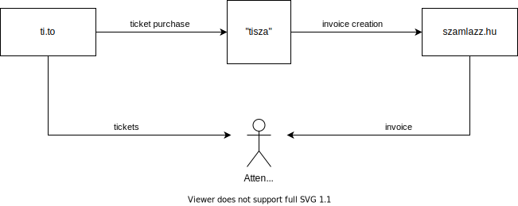

# tisza

[](https://travis-ci.org/jssc-eu/tisza)

ti.to - szamlazz.hu integration proxy service

## What?

[Ti.to](https://ti.to/) is a great ticketing and attendee manager service for events both free and paid.

[Szamlazz.hu](https://szamlazz.hu) is a great invoicing service that covers and handles  all Hungarian tax laws regarding invoices.

## Why?

For larger scale events and conferences in Hungary, we have to put certain mediated services (such as catering for example) on the invoice as a separate item.
Tito can't and probably should not handle this.

## How does this work?

This service, deployed on Heroku, sits between Ti.to and Szamlazz.hu. The chain of events are like this:

1. A purchase is made on Tito
2. Tito calls a webhook on the service
3. The service gets all requred data about the purchase from the Tito API
4. The service creates an invoice XML and send it to Szamlazz.hu using [ewngs/szamlazz.js](https://github.com/ewngs/szamlazz.js)




## Caveats

* This service handles purchases that are already paid via Paypal.
* Free tickets, or manually added tickets are ignored
* Sends an email if some error happens
* Uses the Heroku provided Mailgun service to send test and error emails
* Can handle multiple events, check out the contents of `.env.example` and `events-config.yaml`

## Setup & Configuration

- Clone the repo
- Deploy it to your Heroku account using the tokens and secrets below

Generate a random hash that you'll use as a webhook URL validation token.
Add it to the app settings as an ENV variable `TITO_WEBHOOK_TOKEN`

Get your webhook URL:

`https://__YOUR_DEPLOYED_HEROKU_URL__/register-purchase?token=__TITO_WEBHOOK_TOKEN__`

- Go to your Ti.to event `Dashboard > Settings > Webhook endpoints`
- enter the webhook url you created above
- check the `registration.finished` webhook event

On the Webhook endpoints UI, you see a **Security token**, something like :

> Your security token is `7AD1__________`.

Copy that token, and add it to the Heroku app settings as an environment variable, this will be the **webhook signature validator key**, to validate webhook payload content. **Make sure that this ENV variable name is the same as the `tito-signature-validator-env` field for your event in the `events-config.yaml`**


### ENV variables

See the `.env.example` file.

#### Tito secrets and tokens

- **TITO_WEBHOOK_TOKEN** the token that is sent in the `token` query parameter. This is just an additional layer of security
- **TITO_API_TOKEN** the API token for your tito account, [see the relevant docs on Ti.to](https://ti.to/docs/api/admin#authentication)

And the Tito webhook signature validator keys, which can be in any kind of ENV variable as long as it is
referred properly with the `tito-signature-validator-env` field in the `events-config.yaml` config file.

See the [Ti.to documentation on validating webhook payloads](https://ti.to/docs/api/admin#webhooks-payloads)

#### Szamlazz.hu secrets

- **SZAMLAZZ_TOKEN** the "Számla Agent" token from Szamlazz.hu

#### Mailgun parameters

These are set automatically if you set up Mailgun on Heroku

- **MAILGUN_API_KEY**
- **MAILGUN_DOMAIN**
- **MAILGUN_PUBLIC_KEY**
- **MAILGUN_SMTP_LOGIN**
- **MAILGUN_SMTP_PASSWORD**
- **MAILGUN_SMTP_PORT** Default: 587
- **MAILGUN_SMTP_SERVER** Default: smtp.mailgun.org

#### Error reporting

- **ERROR_EMAIL_ADDRESS** the email address to send error reports

**Note:** if you use the free, sandbox Mailgun integration, set this email as an authorized recipient

### events-config.yaml

```yaml
---
events:

  # every event entry key is the "event slug" in tito, example: "jsconf-budapest-2021"
  tito-event-slug:
    # event label
    label: "JSConf Budapest 2020"

    # handle several dates for you event, for example workshops
    dates:
      # general date for every ticket type
      - ticket-name-contains: "*"
        date: "September 24-25, 2020"
      # if the ticket name contains "workshop", use this date
      - ticket-name-contains: "workshop"
        date: "September 23, 2020"

    # certain mediated services, such as the catering, has to be included on the invoice as a separate item
    # you can handle several amounts of catering in the ticket prices based on the ticket name
    # the net price of the catering has to be provided, it will be calculated and subtracted from the ticket price in Tito
    catering:
        # if the ticket name contains "workshop", calculate with 20 EUR net catering price
      - ticket-name-contains: "workshop"
        net-price: 20
        # if the ticket name contains "online", do not calculate catering
        # providing 0 net price will omit the catering item entry from the invoice for this type of ticket
      - ticket-name-contains: "online"
        net-price: 0
        # amount of catering for every other kind of ticket
      - ticket-name-contains: "*"
        net-price: 40

    # invoice setup
    invoice:
      # szamlazz.hu prefix (has to be set on the szamlazz.hu account)
      id-prefix: "WIPAO"
      # szamlazz.hu logo image (has to be enabled for the szamlazz.hu account)
      logo-image: "JSCBP-szamlazzhu.png"
      # comment on the invoice
      comment: |
        The invoice includes mediated services.
        Paid in full.
        This document was issued electronically and is therefore valid without signature.
      # issue e-invoices or not (has to be enabled for the szamlazz.hu account)
      e-invoice: false
      # currency for the invoice EUR | USD | HUF ...  (see https://github.com/ewngs/szamlazz.js/#currency)
      currency: EUR

    # setup for sending invoice through email in szamlazz.hu
    email:
      reply-to-address: "nec@jsconfbp.com"
      subject: "Your invoice for Integration Test Event 2020"
      message: |
        Dear Attendee!

        Thank you for taking part in Reinforce AI Conference 2020.

        Please find attached our official invoice for the Reinforce AI conference.
        In case you have an issue with the invoice please reply to this e-mail.
        In case you have a general question regarding the conference please write to: hello@reinforceconf.com

        The Reinforce conference team

    # bank information for the invoices
    bank:
      name: "Raiffeisen Bank, SWIFT: UBRTHUHB"
      account-number: "HU18-1201-0659-0160-2199-0020-0008"

    # name of the ENV variable that provides the Tito webhook signature validator key
    tito-signature-validator-env: TITO_TOKEN_JS

```

## License

MIT License

Copyright (c) 2019 jssc-eu

Permission is hereby granted, free of charge, to any person obtaining a copy
of this software and associated documentation files (the "Software"), to deal
in the Software without restriction, including without limitation the rights
to use, copy, modify, merge, publish, distribute, sublicense, and/or sell
copies of the Software, and to permit persons to whom the Software is
furnished to do so, subject to the following conditions:

The above copyright notice and this permission notice shall be included in all
copies or substantial portions of the Software.

THE SOFTWARE IS PROVIDED "AS IS", WITHOUT WARRANTY OF ANY KIND, EXPRESS OR
IMPLIED, INCLUDING BUT NOT LIMITED TO THE WARRANTIES OF MERCHANTABILITY,
FITNESS FOR A PARTICULAR PURPOSE AND NONINFRINGEMENT. IN NO EVENT SHALL THE
AUTHORS OR COPYRIGHT HOLDERS BE LIABLE FOR ANY CLAIM, DAMAGES OR OTHER
LIABILITY, WHETHER IN AN ACTION OF CONTRACT, TORT OR OTHERWISE, ARISING FROM,
OUT OF OR IN CONNECTION WITH THE SOFTWARE OR THE USE OR OTHER DEALINGS IN THE
SOFTWARE.
